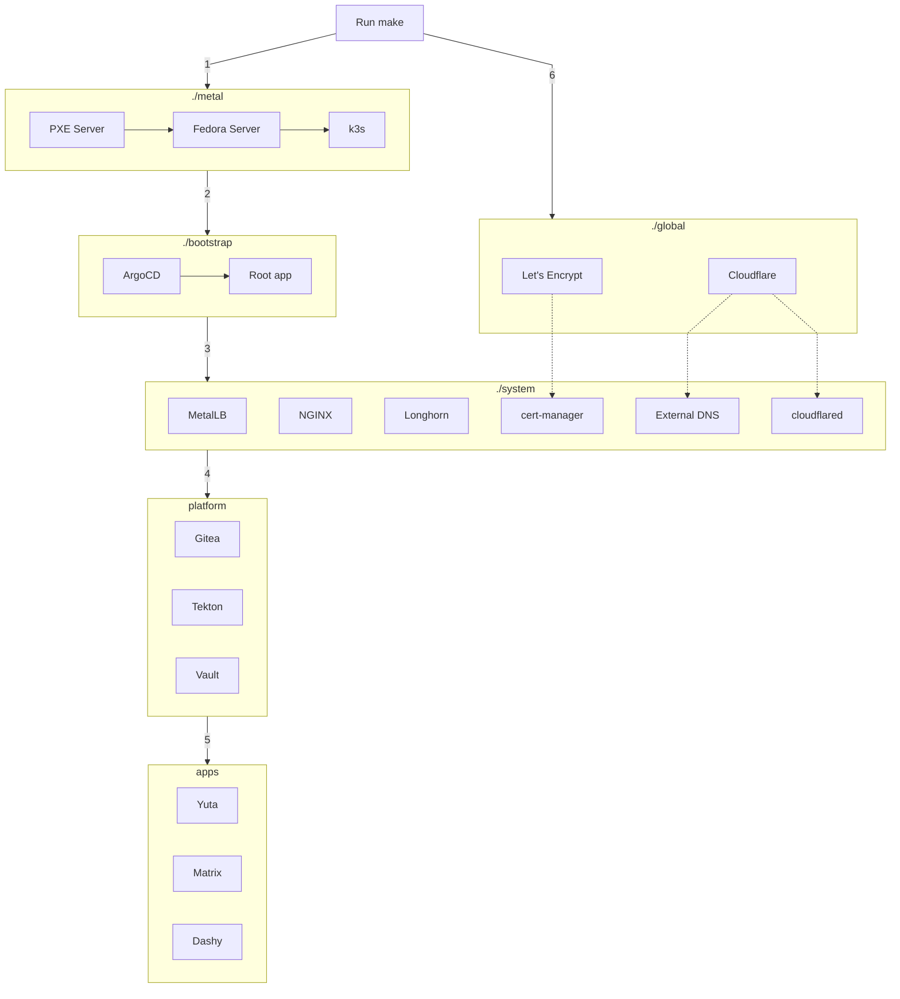

!!! note "Acknowledgement"

    Cloned from provisioning flow in [khuedoan/homelab/reference/architecture](https://homelab.khuedoan.com/reference/architecture/)

Everything is automated, after you edit the configuration files, you just need to run a single `make` command and it will:

- (1) Build the `./metal` layer:
    - Create an ephemeral, stateless PXE server
    - Install Linux on all servers in parallel
    - Build a Kubernetes cluster (based on k3s)
- (2) Build the `./bootstrap` layer:
    - Install ArgoCD
    - Configure the root app to manage other layers (and also manage itself)

From now on, ArgoCD will do the rest:

- (3) Build the `./system` layer (storage, networking, monitoring, etc)
- (4) Build the `./platform` layer (Gitea, Vault, etc)
- (5) Build the `./apps` layer: (Dashy, Yuta, Dendrite, etc)
- (6) Build the `./global` layer: (Cloudflare and stuffs)

